<h1 align="center">JAVA Programação Orientada a Objetos</h1>

<h3 align="center"> Canal do YouTube: <a href="https://www.youtube.com/watch?v=KlIL63MeyMY&list=PLHz_AreHm4dkqe2aR0tQK74m8SFe-aGsY">Gustavo Guanabara
</a> </h3>

> _Eu fiz com Eclipse_

**(...) continua ->Curso POO Java #11b - Herança (Parte 2)**

> POO -> aproximar o mundo digital do mundo real
> 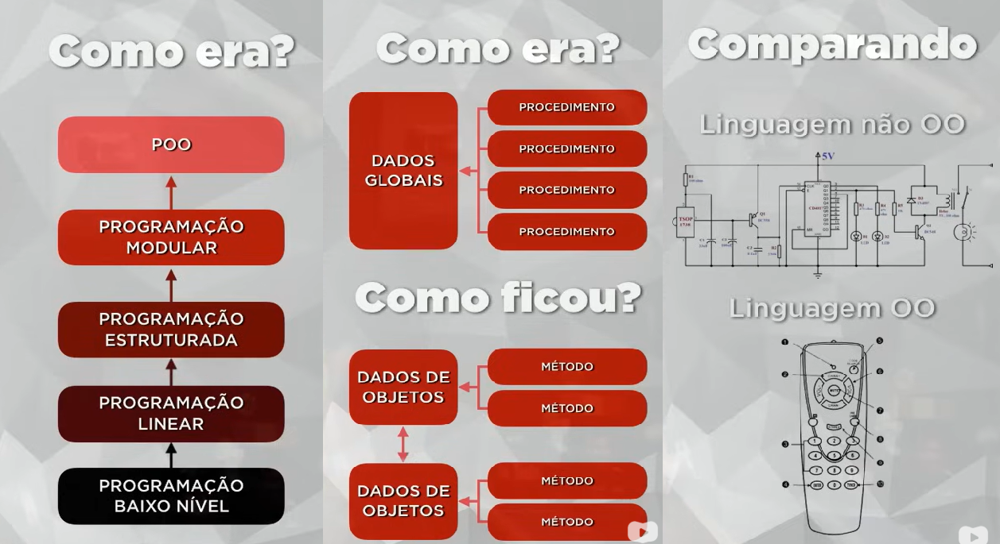

> Vantagens
> 

> Objeto -> pode ser concretos (físicos - carro, celular) ou conceituais (abstrações - um horário marcado, uma aula)

- características - atributo, propriedade, dados;
- comportamentos - métodos, procedimentos das rotinas internas desse objeto;
- estado ou status - características atuais no momento em que esta analisando esse objeto;
- Todo objeto vem a partir de uma classe, um molde que foi utilizado para criar essa classe, esse objeto precisa ser planejado;

  > 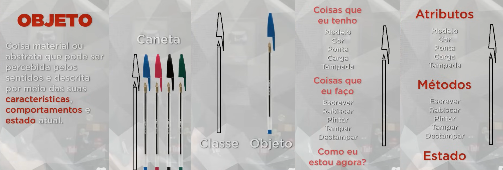

- Consegui dentro dos métodos mexer com os atributos do objeto e interagir dessa maneira com usuário:
  > 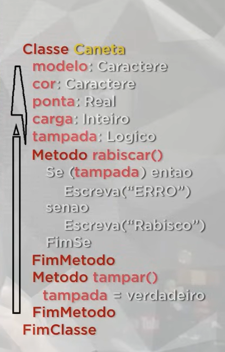
  > 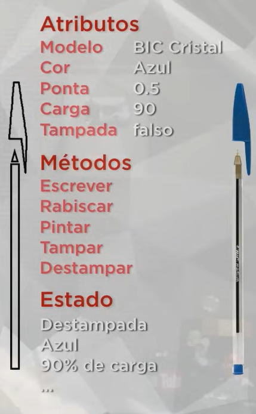
  > </br>

> Classe e Objeto -> um conceito depende do outro

- Quando tem uma classe e quero transformar em objeto é instanciamento;
- Instanciar é quando pega uma classe e consegui gerar um objeto a partir dela, não transforma uma classe em objeto, gera um objeto a partir de uma classe chama isso de instanciar;
- Uma classe define os atributos e métodos comuns que serão compartilhados por um objeto;
- O objeto é uma instância de uma classe, quando instâcia uma classe cria um objeto;
  > 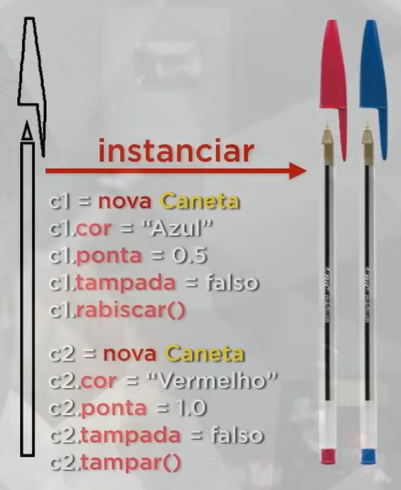
  > </br>

> Conceito de abstração

- Quais são os atributos que me importam nesse momento ? EX.: pessoas tem várias caracteristicas, em um cadastro escolar não precisa ter peso, altura, cor dos olhos...

> 'this' -> é o nome do objeto que chamo, no exercicio quem chamo tampar foi 'c1', então o 'this' é substituido por 'c1' no momento em que 'c1' chamar o método tampar;

- Sempre que quiser modificar algum atributo dentro da própria classe coloque a palavra 'this' na frente da linha que vai mexer nesse atributo:

> 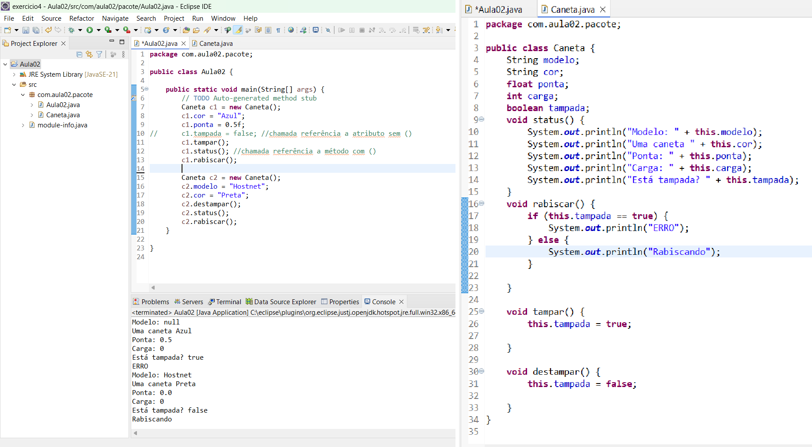
> </br>

> Conceito LMU ou UML - lINGUAGEM DE MODELAGEM UNIFICADA

- Diagrama de classes -> em diagrama de classes toda classe é um retângulo(não precisa desenhar uma classe/molde - simplifica);
- Dentro desse retângulo na parte superior geralmente em negrito e a primeira letra em maiúsculo, coloca o nome da classe, depois faz 2 traços separando a parte de cima o cabeçalho, o miolo o corpo central e a parte de baixo;

> Classe - primeira letra maiúscula </br>
> Atributo - tudo minúscula e sem ()</br>
> Método - tudo minúscula e com ()</br> > 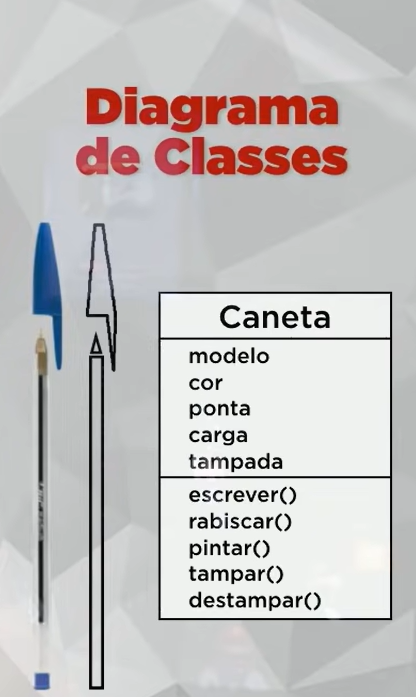</br>

> Modificadores de Visibilidade

- Indicam o nível de acesso aos componentes internos de uma classe (atributos e métodos);
  > '+' público -> a classe atual e todas as outras classes; </br>
  > '-' privado -> somente a classe atual; </br>
  > '#' protegido -> a classe atual e todas as suas sub-classes; 'só minha mãe e os filhos dela';</br> 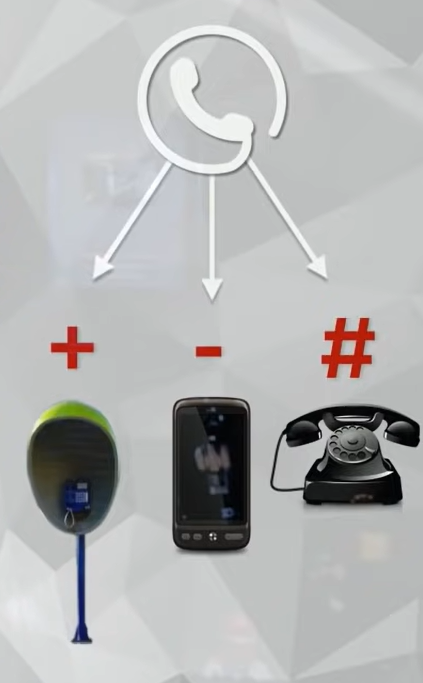 </br> 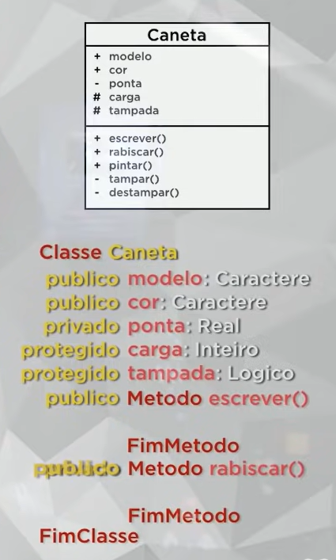
- A parte de fora pode ter acesso publico, interface;
- Os componentes é privado para não danificar;</br>
  **Cria-se essa cápsula para proteger e deixar disponível somente a parte publica**
- O componente que faz a transmissão infravermelho na televisão para fazer a interface, o uso desse componente tem que ficar inacessível ao dono mas também tem que deixar ele acessível a televisão, seria uma espécie de atributo protegido;

  > 

- O que está executando é o método 'main', ele está dentro de uma classe que está utilizando a classe caneta;
- Dentro da classe Aula02, tem um método principal que está utilizando o objeto 'c1' que é uma caneta então ele vai deixar mexer num atributo protegido porque ele esta dentro de uma classe que utiliza a classe caneta mas não dos privados:

```
public class Caneta
	public String modelo;
	public String cor;
	private float ponta;
	protected int carga;
	protected boolean tampada;
	public void status()
```

```
public class Aula02

	public static void main(String[] args) {
		Caneta c1 = new Caneta();
		c1.modelo = "BIC cristal";
		c1.cor = "Azul";
		// c1.ponta = 0.5f;
		c1.carga = 80;
		c1.tampada = true;
		c1.status();
	}
          SAÍDA: Modelo: BIC cristal
                 Uma caneta Azul
                 Ponta: 0.0
                 Carga: 80
                 Está tampada? true
```

- Não pode mexer no atributo 'tampada' e os métodos passa para publico;
- 'tampar' e 'destampar' que são métodos publicos vão dar acesso ao atributo 'tampada' que é privado;
- Chamei o 'destampar' e dentro do código 'destampar' esta fazendo com que o 'tampada' fique falso;
- O privado só quem pode mexer é a própria classe;

```
private boolean tampada;
```

```
	public void tampar() {
		this.tampada = true;

	}

	public void destampar() {
		this.tampada = false;

	}
```

```
	public static void main(String[] args) {
		// TODO Auto-generated method stub
		Caneta c1 = new Caneta();
		c1.modelo = "BIC cristal";
		c1.cor = "Azul";
		// c1.ponta = 0.5f;
		c1.carga = 80;
//		c1.tampada = true;
		c1.destampar();
		c1.status();
		c1.rabiscar();

	}       SAÍDA: Modelo: BIC cristal
                 Uma caneta Azul
                 Ponta: 0.0
                 Carga: 80
                 Está tampada? false
                 Rabiscando
```

> Métodos especiais

> Métodos acessores -> métodos que dão acesso uma determinada coisa, tecnicamente são mais conhecidos como 'getters' e 'setters'

> Getters

- O método getter vai proibir que tenha acesso diretamente ao atributo, vai dificultar o acesso direto ao objeto;
- Conseguem acessar um determinado atributo mantendo a segurança de acesso a ele;
  > 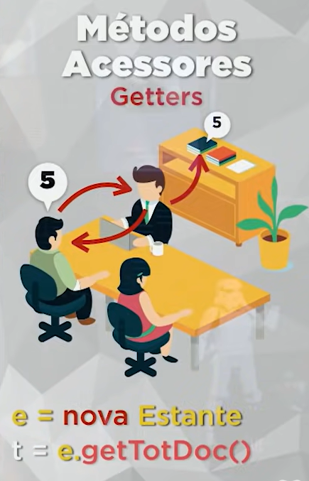</br>
- Exemplo: a estante é o objeto com documentos é os atributos e as pessoas querem saber quantos documentos é referente a elas;
  > 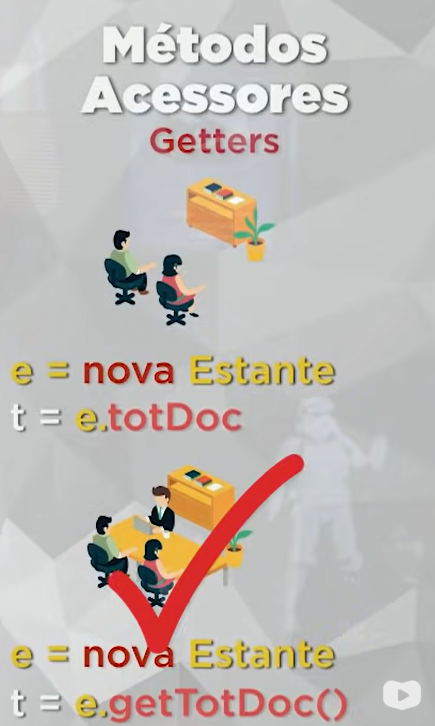</br>

> Métodos modificadores

> Setters

- Modificam coisas que estão dentro do objeto garantindo támbem uma total segurança do atributo, eu não vou deixar as pessoas mexerem diretamente um atributo;
- Preciso passar um documento como parâmetro, dentro dos parêntese '(doc)', normalmente o método 'setter' precisa de um parâmetro para poder funcionar;
- Na imagem a parte de baixo foi mais abstrato mais simplificado, na parte de cima teve que ser mais descritivo:

  > 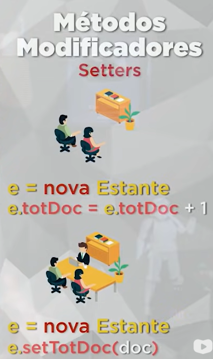</br>

- Declarei os 2 atributos (Caractere/Real), coloquei visibilidade (publico/privado), definindo o getter e o setter de modelo, coloca as linhas de declaração do get modelo e set modelo, o set modelo recebe um parâmetro que é do mesmo tipo do atributo, o método set modelo recebe 'm' que é caractere que é o mesmo tipo de modelo que é o atributo do método setter esta mexendo **(m:Caractere)**;
- Definindo o get modelo -> é retornar o modelo, o 'retorne' vai retornar o modelo que é um atributo, para fazer o set modelo, vai ter que mudar o atributo modelo, para mudar precisa colocar modelo recebe 'm' **(modelo = m)**;
- Temos o código definitivo desse trecho da classe;
- Criando o objeto da classe caneta **(c1 = nova Caneta)**;
- c1 é um objeto de caneta -> **(c1.setModelo("BIC Cristal"))** = c1 seja do modelo 'BIC Cristal', passei uma string, uma cadeia de caracteres para set modelo, em set modelo recebe uma cadeia de caractere **(m:Caractere)** então Bic Cristal vai ser o valor de 'm';
- Dessa maneira consegui modificar o atributo sem deixar o programador mexesse diretamente no atributo;
- A chamada para o setters -> c1.setModelo("BIC Cristal");
- Chamdas para os **getters** -> **Escreva ((c1.getModelo()))** -> get normalmente não passa parâmetro, vai escrever o resultado de c1.getModelo, o retorno: chamei o método getModelo que vai retornar o valor de modelo (BIC Cristal) que foi feito na chamada setModelo;
  **Método é a mesma coisa que procedimento e função**
  > 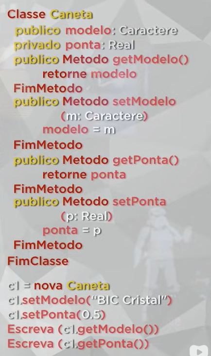</br>

> Método Construtor -> executa uma tarefa sem que o usuário faça uma chamda, que inicie automatico;

- Assim que colocar o comando **c1 = nova Caneta** vai criar uma caneta azul e ela vai estar tampada:
  > 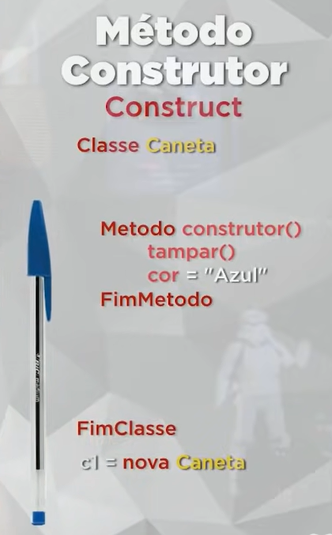</br>

> Támbem pode começar com parâmetros:

- Criar um método construtor com 3 parâmetros **'m/c/p'**, faz a chamada de 3 médotos modificadores **'set'** e **'tampar'**; e faz o instanciamento **'c1 = nova Caneta'** com os parâmetros;
  > 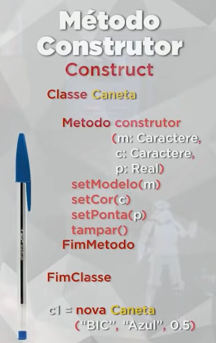</br>

> EXERCÍCIO:

```
Caneta

package com.aula4.pacote;

public class Caneta {
	public String modelo;
	private float ponta;

	public String getModelo() {
		return this.modelo;
	}

	public void setModelo(String m) {
		this.modelo = m;
	}

	public float getPonta() {
		return this.ponta;
	}

	public void setPonta(float p) {
		this.ponta = p;
	}

	public void status() {
		System.out.println("Sobre a caneta:");
		System.out.println("Modelo: " + this.modelo);
		System.out.println("Ponta: " + this.ponta);

    // saída com get
    System.out.println("Modelo: " + this.getModelo());
		System.out.println("Ponta: " + this.getPonta());
	}
}
```

> 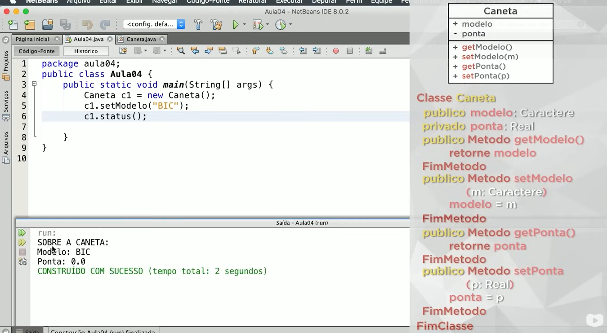</br>

> Construtor -> o método construtor sempre tem o nome da classe;

```
package com.aula4.pacote;

public class Caneta {
	public String modelo;
	private float ponta;
	private String cor;
	private boolean tampada;

	public Caneta() {
		this.tampar();
		this.cor ="Azul";
	}

	public String getModelo() {
		return this.modelo;
	}

	public void setModelo(String m) {
		this.modelo = m;
	}

	public float getPonta() {
		return this.ponta;
	}

	public void setPonta(float p) {
		this.ponta = p;
	}

	public void tampar() {
		this.tampada = true;
	}

	public void destampar() {
		this.tampada = false;
	}

	public void status() {
		System.out.println("Sobre a caneta:");
		System.out.println("Modelo: " + this.modelo);
		System.out.println("Ponta: " + this.ponta);

		System.out.println("Modelo: " + this.getModelo());// saida com get
		System.out.println("Ponta: " + this.getPonta());

		System.out.println("Cor: " + this.cor);
		System.out.println("Tampada: " + this.tampada);
	}
}
```

> 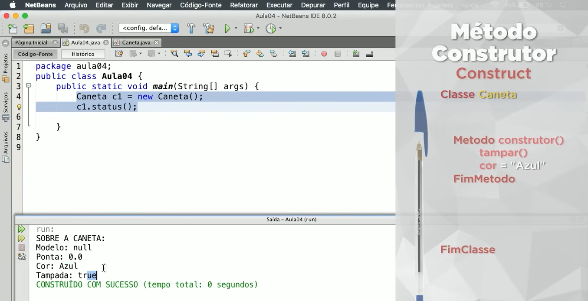</br>

> Contrutor com parâmetros

> 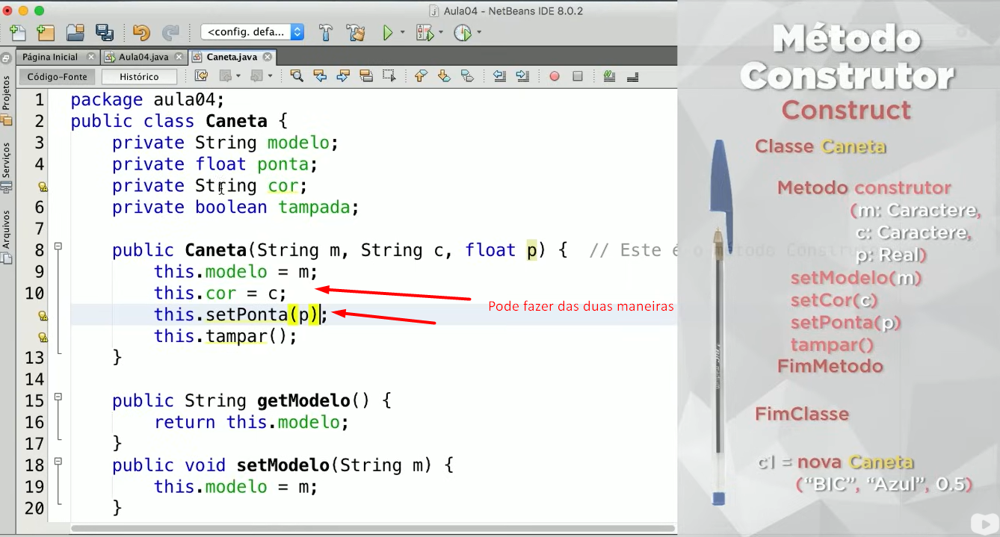</br>

```
package com.aula4.pacote;

public class Aula4 {

	public static void main(String[] args) {
		Caneta c1 = new Caneta("Teste", "Vermelho", 0.8f);
		c1.status();

		Caneta c2 = new Caneta("Teste2", "Laranja", 1.0f);
		c2.status();
	}
}               SAÍDA:Sobre a caneta:
                      Modelo: Teste
                      Ponta: 0.8
                      Cor: Vermelho
                      Tampada: true
                      Sobre a caneta:
                      Modelo: Teste2
                      Ponta: 1.0
                      Cor: Laranja
                      Tampada: true
```

> EXERCÍCIO:

```
aula5

ContaBanco

Atributos:

TODOS ATRIBUTOS VÃO TER GET E SET / CONSTRUTOR SEMPRE QUE CRIAR UMA CONTA SEU STATUS É FALSE(pq a conta está fechada ainda e o saldo definido como 0)

+ numConta
# tipo -> vai aceitar apenas 2 valores / caractere 'cc' 'cp'
- nome
- saldo
- status

Métodos:

+ abrirConta() -> quando abri a conta muda o status para true / se não esta aberta é false, quando abrir a conta precisa dizer que tipo é cc ou cp

+ adicional se abrir conta cc já ganha 50$ e cp 150$

+ fecharConta() -> não vai poder ter dinheiro e não vai poder ter débito

+ depositar() -> ela tem que estar aberta o status true

+ sacar() -> ela tem que estar aberta o status true e também precisa de saldo

+ pagarMensalidade() -> ela é cobrada mensal, cc paga 12$ cp paga 20$
```

> 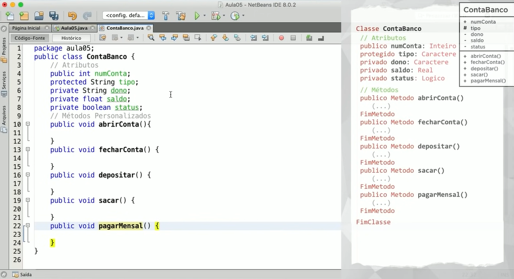</br>

> 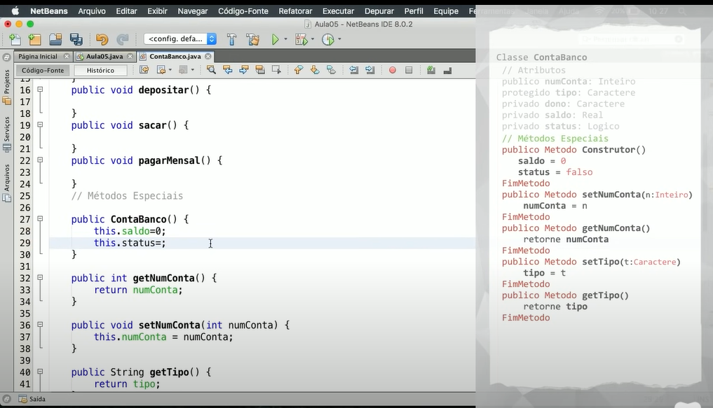</br>

> 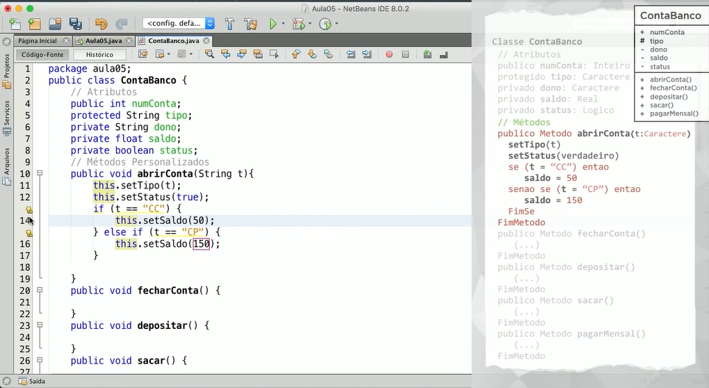</br>

> 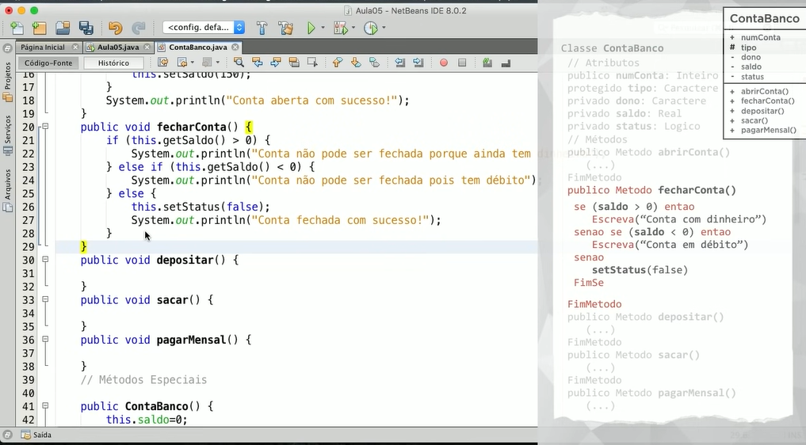</br>

> 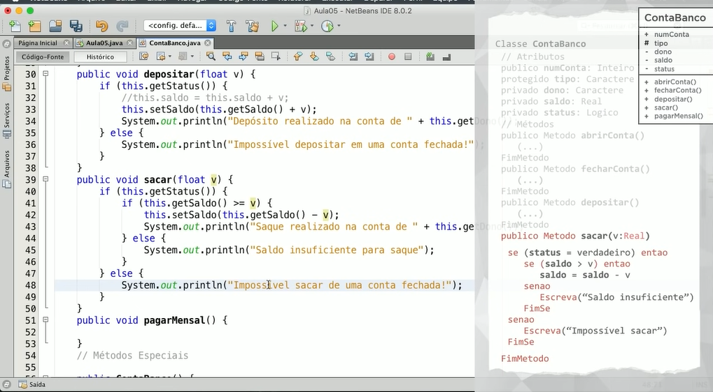</br>

> 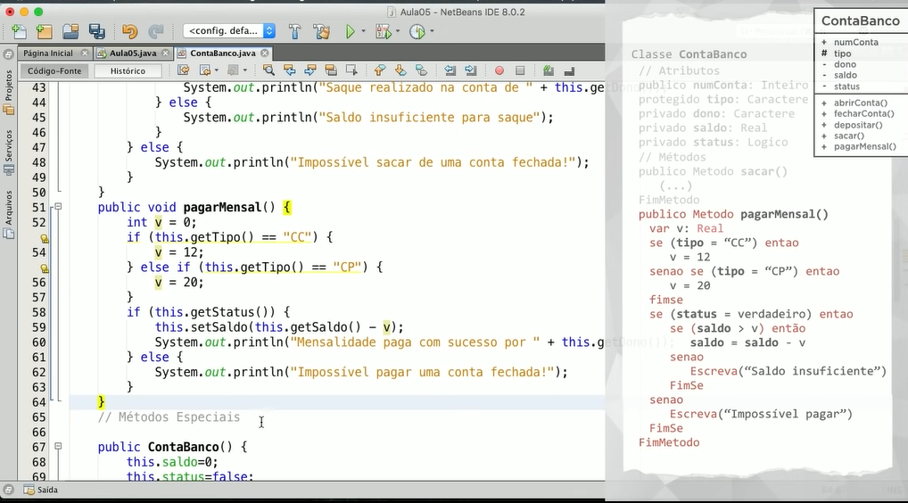</br>

```
****ContaBanco****

package com.aula05.pacote;

public class ContaBanco {
	public int numConta;
	protected String tipo;
	private String dono;
	private double saldo;
	private boolean status;

	public void estadoAtual() {
		System.out.println("----------------------------");
		System.out.println("Conta: " + this.getNumConta());
		System.out.println("Tipo: " + this.getTipo());
		System.out.println("Dono: " + this.getDono());
		System.out.println("Saldo: " + this.getSaldo());
		System.out.println("Status: " + this.getStatus());
	}

	public void ContaBanco() {
		this.saldo = 0;
		this.status = false;
	}

	public int getNumConta() {
		return this.numConta;
	}

	public void setNumConta(int n) {
		this.numConta = n;
	}

	public String getTipo() {
		return this.tipo;
	}

	public void setTipo(String t) {
		this.tipo = t;
	}

	public String getDono() {
		return this.dono;
	}

	public void setDono(String d) {
		this.dono = d;
	}

	public double getSaldo() {
		return this.saldo;
	}

	public void setSaldo(double s) {
		this.saldo = s;
	}

	public boolean getStatus() {
		return this.status;
	}

	public void setStatus(boolean st) {
		this.status = st;
	}

	public void abrirConta(String t) {
		this.setTipo(t);
		this.setStatus(true);
		if (t.equals("CC")) {
			this.setSaldo(50);
		} else if (t.equals("CP")) {
			this.setSaldo(150);
		}
		System.out.println("Conta aberta com sucesso");
	}

	public void fecharConta() {
		if (this.getSaldo() > 0) {
			System.out.println("Conta com dinheiro");
		} else if (this.getSaldo() < 0) {
			System.out.println("Conta em débito");
		} else {
			this.setStatus(false);
			System.out.println("Conta fechada com sucesso");
		}

	}

	public void depositar(double v) {
		if (status == true) {
//			saldo += v; outra forma
			this.setSaldo(getSaldo() + v);
			System.out.println("Dépósito realizado com sucesso");
		} else {
			System.out.println("Imposível deposita"); // Conta fechada
		}
	}

	public void sacar(double v) {
		if (this.getStatus()) { // Verifica se a conta está ativa
			if (this.getSaldo() >= v) { // Verifica se há saldo suficiente
				this.setSaldo(this.getSaldo() - v);
				System.out.println("Saque realizado com sucesso!");
			} else {
				System.out.println("Saldo insuficiente");
			}
		} else {
			System.out.println("Impossível sacar: conta inativa");
		}
	}

	public void pagarMensalidade() {
		double v = 0; // Atribui um valor inicial à variável v

		if (tipo.equals("CC")) { // Verifica se tipo é "CC"
			v = 12;
		} else if (tipo.equals("CP")) { // Verifica se tipo é "CP"
			v = 20;
		} else {
			System.out.println("Tipo inválido");
			return; // Se o tipo não for "CC" nem "CP", sai do método
		}

		if (status == true) {
			if (saldo > v) {
				this.setSaldo(getSaldo() - v); // Atualiza o saldo
			} else {
				System.out.println("Saldo insuficiente");
			}
		}
	}

}

```

```
Aula05

package com.aula05.pacote;


public class Aula05 {
	public static void main(String[] args) {
		ContaBanco p1 = new ContaBanco();
		p1.setNumConta(1111);
		p1.setDono("Eduardo");
		p1.abrirConta("CC");

		p1.depositar(500);
		p1.sacar(150);
		p1.fecharConta();

		p1.estadoAtual();

		ContaBanco p2 = new ContaBanco();
		p2.setNumConta(2222);
		p2.setDono("Augusto");
		p2.abrirConta("CP");

		p2.estadoAtual();
	}
}

```

> Os pilares da POO -> Encapsulamento / Herança / Polimorfismo

> Encapsulamento -> cria um padrão e tem proteção;

> Conceito de cápsula

- Um software encapsulado tem um mesmo padrão, protege o usuário do código e o código do usuário, o usuário no caso o programador;
- Um código encapsulado usa interfaces, usa moldes padrão e esses moldes padrão fazem com que o código que tá la dentro não importe como eu vou fazer o código, o que importa é que o resultado seja sempre o mesmo;

> Conceito de encapsular

- Ocultar partes independentes da implementação, permitindo construir partes invisíveis ao mundo exterior;
  **Encapsular não é obrigatório, mas é uma boa prática para produzir Classes mais eficientes**

> 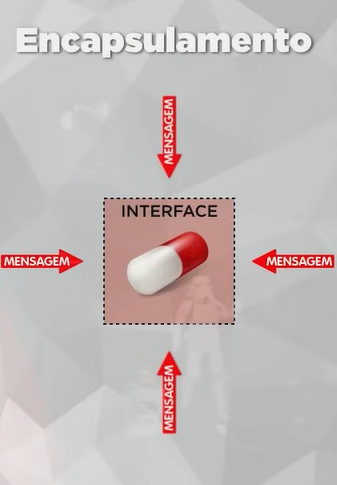</br>

> Vantagens de encapsular ->

> 1 - Tornar mudanças invisíveis

- Se eu tiver que mudar um software por dentro, se ele está bem encapsulado mantendo a interface, mantendo o padrão;
  > 2 - Facilitar a reutilização do código
- Um software e uma classe bem encapsulada pode ser utilizada em outros projetos;
  > 3 - Reduzir efeitos colaterais
- Um software não encapsulado pode ser 'destruído' por um programador, o programa de um programador pode ser afetado se uma classe modificar e não tiver bem encapsulada, se mudar a interface;

- EXEMPLO.: um carro é uma capsula, o pedal a direção seria a interface, utilizamos mas não precisamos saber o que acontece por dentro;

> Para Encapsular -> usando a sintaxxe UML

- 1 - Criando a interface, é parecida com uma classe só que ela não tem atributo, uma interface só tem métodos;
- Métodos abstratos -> é aquele método que não vai ser desenvolvido na interface, eu não vou escrever o código do método na interface, eu só vou dizer na interface que vai existir um método de abrir, vai existir um método de aumentar volume(Ex.: 1 controle de DVD e um de TV), não preciso dizer o que vai acontecer para aumentar o volume, eu só quero saber qual vai ser a reação; exemplo.: a ação de apertar aumentar o volume é a mesma, a interface é a mesma, só que o funcionamento, a implementação é diferente;
- Geralmente dentro de uma interface todos os métodos que são definidos, são definidos como público;
  > 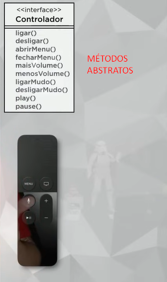</br>
- Quando encapsula, todos atributos devem ser privados, até protegidos mas nunca públicos;
  > 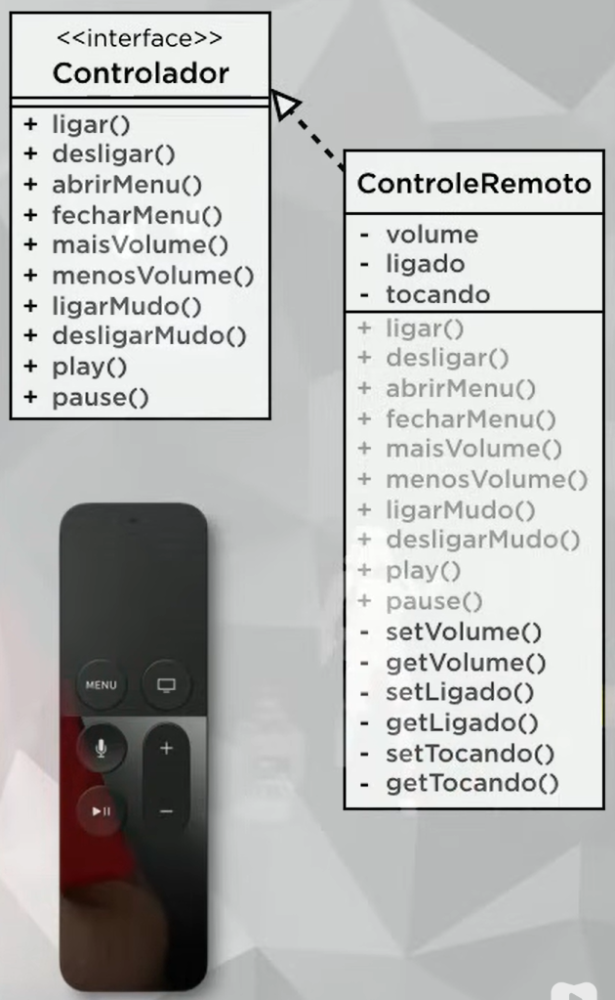</br>
- Abstrato significa que eu não vou desenvolver o código ali dentro eu vou definir ele em outro lugar quando eu implementar minha interface;
  > 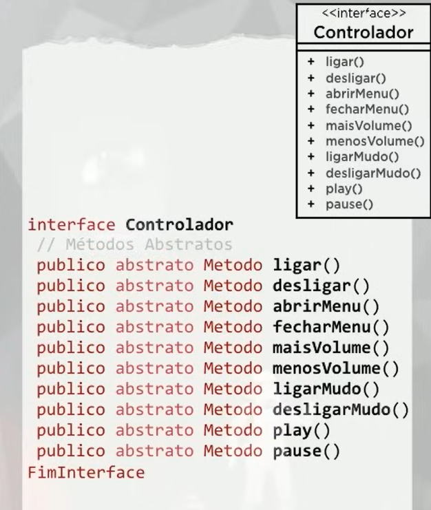</br> > 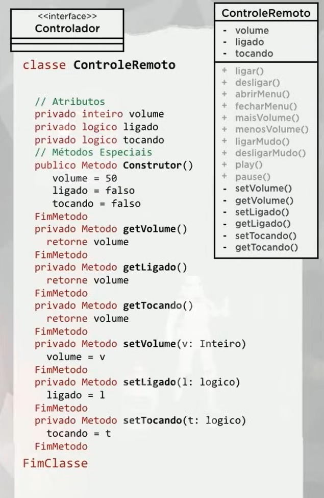</br> > 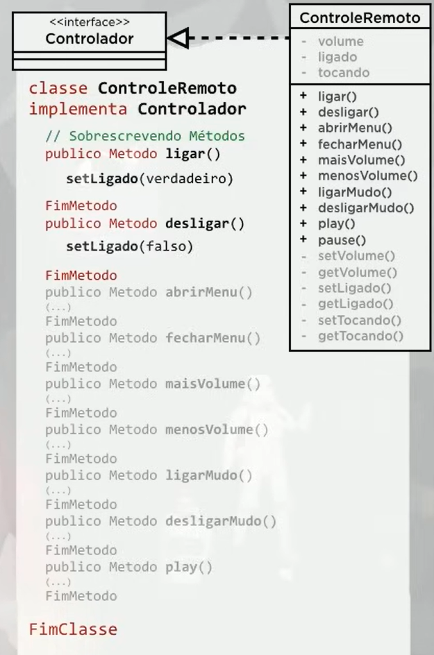</br> > 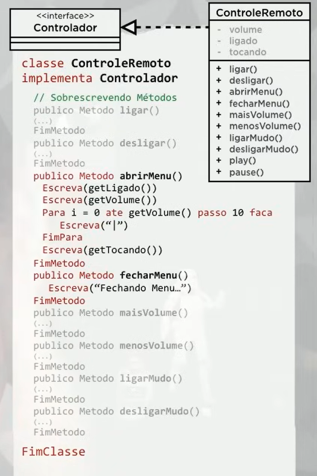</br> > 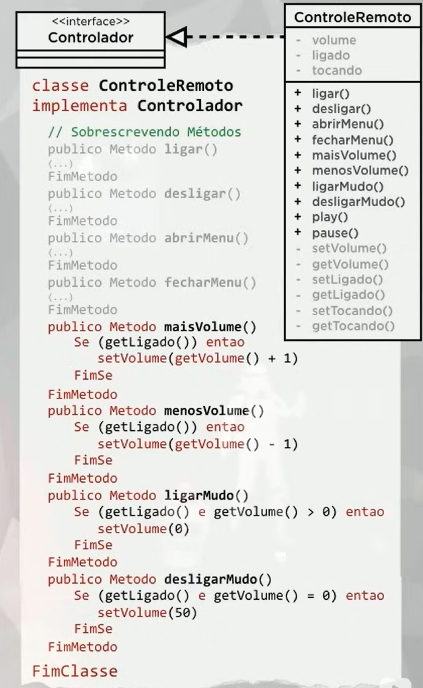</br> > 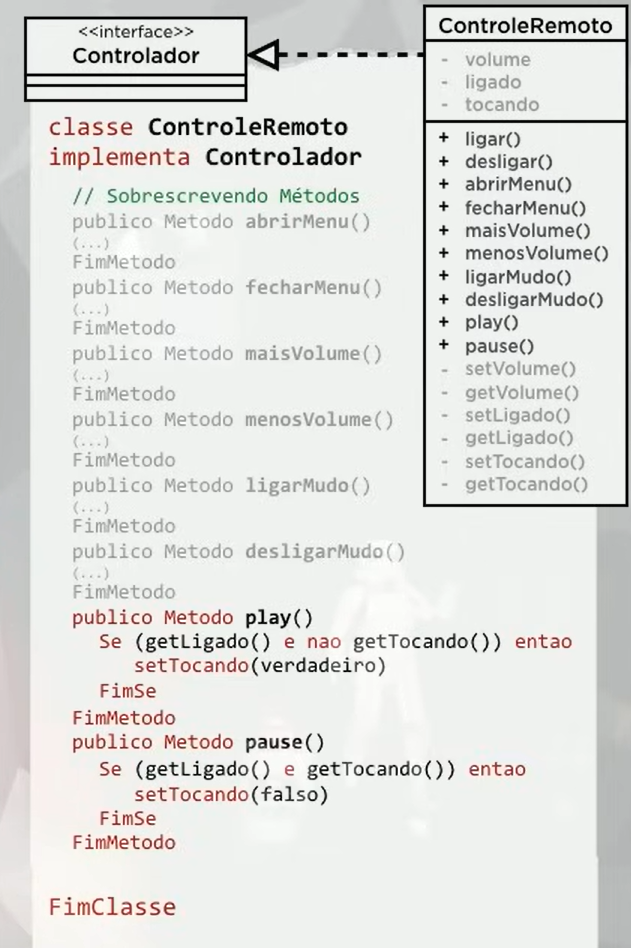</br>
- Método abstrato não precisa abrir e fechar bloco;

> EXERCÍCIO AULA 06

> 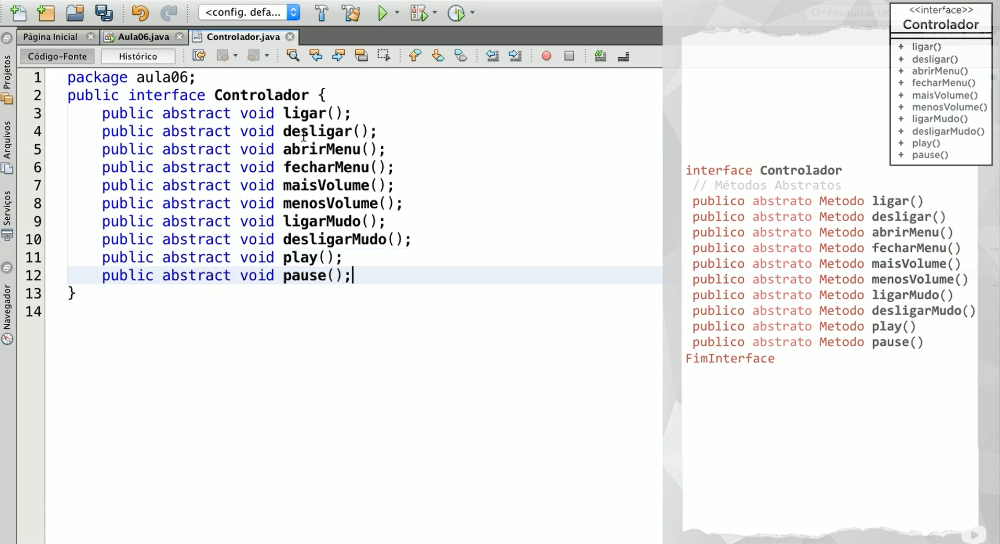</br> > 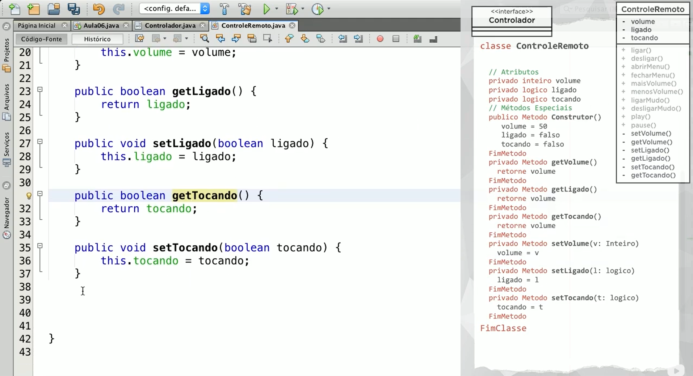</br>

- **Override** -> significa sobrescrever, que eu já tinha um método definido que era um método abstrato e que agora eu estou sobrescrevendo isso, eu estou desconsiderando aquela programação que não tinha sido feita e agora eu vou programar cada um deles;
  > 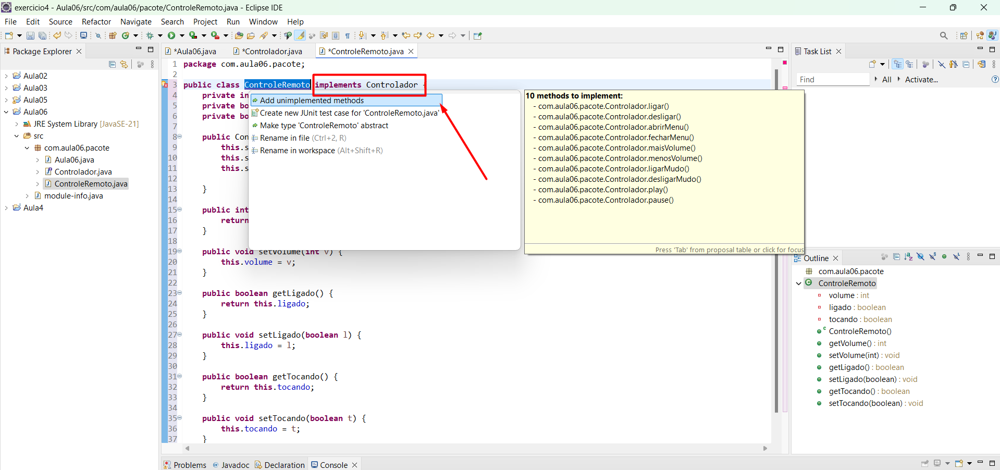</br> > 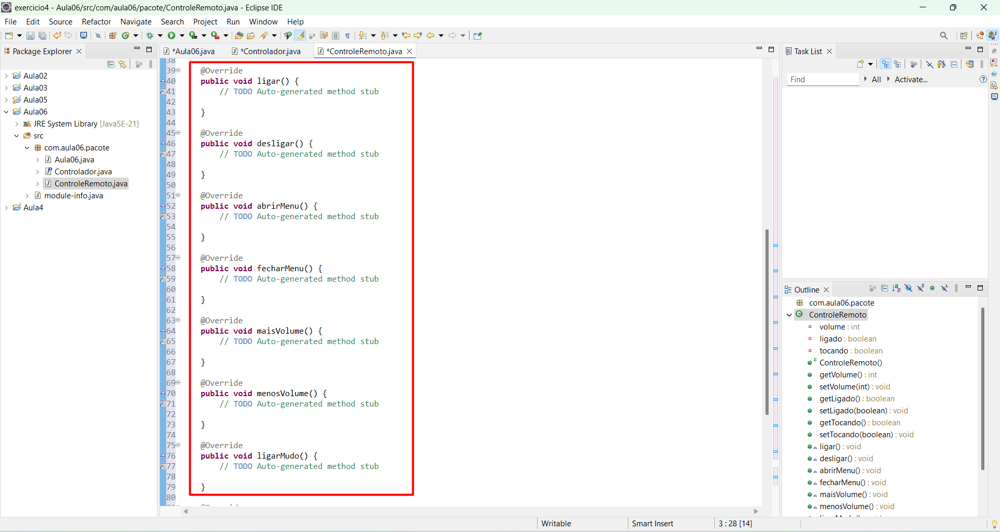</br> > 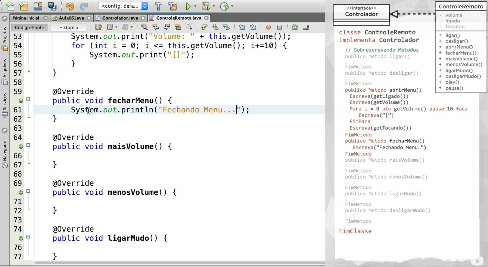</br> > 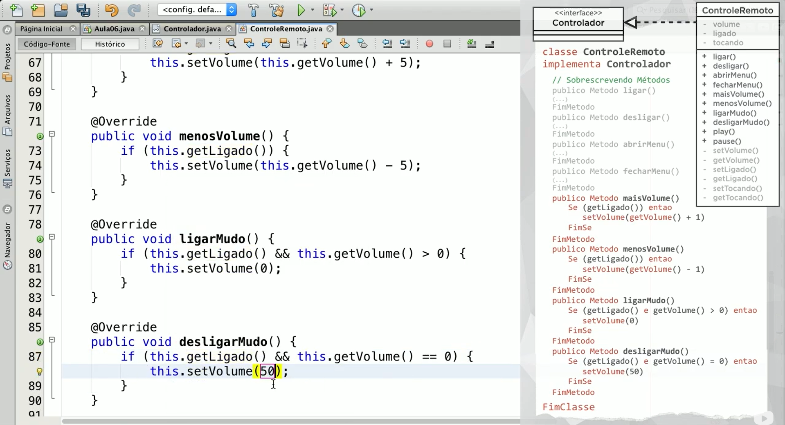</br>

````
Aula06

package com.aula06.pacote;

public class Aula06 {
	public static void main(String[] args) {
		ControleRemoto c = new ControleRemoto();
		c.ligar();
		c.maisVolume();
		c.abrirMenu();

	}

}
```

```
Controlador

package com.aula06.pacote;

public interface Controlador {
	public abstract void ligar();
	public abstract void desligar();
	public abstract void abrirMenu();
	public abstract void fecharMenu();
	public abstract void maisVolume();
	public abstract void menosVolume();
	public abstract void ligarMudo();
	public abstract void desligarMudo();
	public abstract void play();
	public abstract void pause();
}
```

```
ControleRemoto

package com.aula06.pacote;

public class ControleRemoto implements Controlador {
	private int volume;
	private boolean ligado;
	private boolean tocando;

	public ControleRemoto() {
		this.setVolume(50);
		this.setLigado(false);
		this.setTocando(false);

	}

	private int getVolume() {
		return this.volume;
	}

	private void setVolume(int v) {
		this.volume = v;
	}

	private boolean getLigado() {
		return this.ligado;
	}

	private void setLigado(boolean l) {
		this.ligado = l;
	}

	private boolean getTocando() {
		return this.tocando;
	}

	private void setTocando(boolean t) {
		this.tocando = t;
	}

	@Override
	public void ligar() {
		// TODO Auto-generated method stub
		this.setLigado(true);
	}

	@Override
	public void desligar() {
		// TODO Auto-generated method stub
		this.setLigado(false);
	}

	@Override
	public void abrirMenu() {
		// TODO Auto-generated method stub
		System.out.println("Está ligado? " + this.getLigado());
		System.out.println("Está tocando? " + this.getTocando());
		System.out.print("Volume: " + this.getVolume());
		for(int i = 0; i<= this.getVolume(); i+=10) {
			System.out.print("|");
		}
	}

	@Override
	public void fecharMenu() {
		// TODO Auto-generated method stub
		System.out.println("Fechando Menu");
	}

	@Override
	public void maisVolume() {
		// TODO Auto-generated method stub
		if (this.getLigado()) {
			this.setVolume(this.getVolume()+5);

		}
	}

	@Override
	public void menosVolume() {
		// TODO Auto-generated method stub
		if (this.getLigado()) {
			this.setVolume(this.getVolume()-5);
		}

	}

	@Override
	public void ligarMudo() {
		// TODO Auto-generated method stub
		if (this.getLigado() && this.getVolume() >0) {
			this.setVolume(0);
		}
	}

	@Override
	public void desligarMudo() {
		// TODO Auto-generated method stub
		if (this.getLigado() && this.getVolume() == 0) {
			this.setVolume(50);
		}
	}

	@Override
	public void play() {
		// TODO Auto-generated method stub
		if (this.getLigado() && !(this.getTocando())) {
			this.setTocando(true);
		}
	}

	@Override
	public void pause() {
		// TODO Auto-generated method stub
		if (this.getLigado() && this.getTocando()) {
			this.setTocando(false);
		}

	}
}
````

> Relacionamento entre Classes

- O construtor vai fazer essa chamada e eu vou definir o objeto de forma simples usando apenas uma linha;
- Tem que fazer a definição de cada um deles e já pode chamar os métodos;

  > 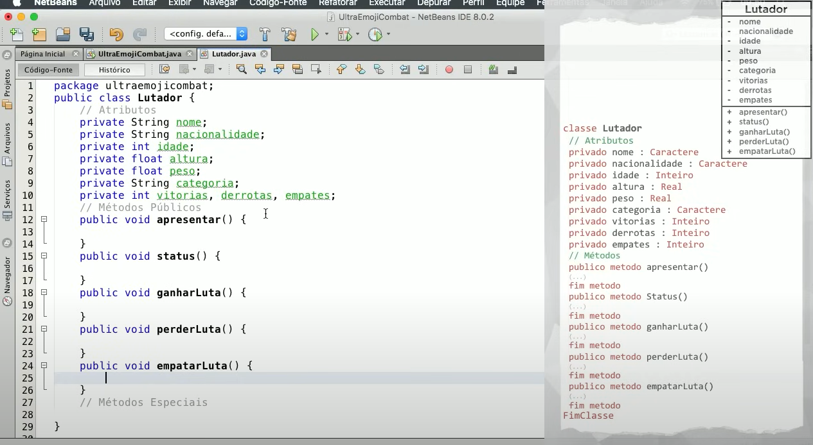</br> > 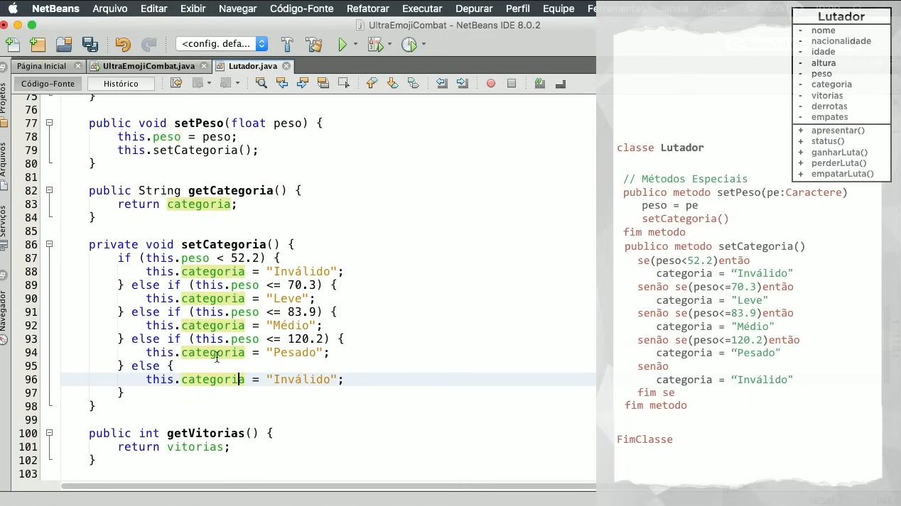</br>

- Objeto dentro de um vetor: Lutador[] L = new Lutador[6];

```
AULA 7

package com.ufc.pacote;

public class Ufc {
	public static void main(String[] args) {
		Lutador[] L = new Lutador[6];
		L[0] = new Lutador ("JAVA", "França", 31, 1.75f, 68.9f, 11, 3, 1);
		L[1] = new Lutador ("JS", "Brasil", 31, 1.7f, 57.8f, 11, 3, 1);
		L[2] = new Lutador ("CSS", "Argentina", 31, 1.75f, 80.9f, 11, 3, 1);
		L[3] = new Lutador ("HTML", "Holanda", 31, 1.75f, 81.6f, 11, 3, 1);
		L[4] = new Lutador ("REACT", "Espanha", 31, 1.75f, 62f, 11, 3, 1);
		L[5] = new Lutador ("C#", "Alemanha", 31, 1.75f, 53f, 11, 3, 1);
		L[0].status();
		L[3].apresentar();
	}
}
```

```
package com.ufc.pacote;

public class Lutador {
	private String nome;
	private String nacionalidade;
	private int idade;
	private double altura;
	private double peso;
	private String categoria;
	private int vitorias;
	private int derrotas;
	private int empates;

	public Lutador(String no, String na, int i, double a, double p, int v, int d, int e) {
		this.setNome(no);
		this.setNacionalidade(na);
		this.setIdade(i);
		this.setAltura(a);
		this.setPeso(p);
		this.setVitorias(v);
		this.setDerrotas(d);
		this.setEmpates(e);
	}

	public String getNome() {
		return this.nome;
	}

	public void setNome(String no) {
		this.nome = no;
	}

	public String getNacionalidade() {
		return this.nacionalidade;
	}

	public void setNacionalidade(String na) {
		this.nacionalidade = na;
	}

	public int getIdade() {
		return this.idade;
	}

	public void setIdade(int i) {
		this.idade = i;
	}

	public double getAltura() {
		return this.altura;
	}

	public void setAltura(double a) {
		this.altura = a;
	}

	public double getPeso() {
		return this.peso;
	}

	public void setPeso(double p) {
		this.peso = p;
		this.setCategoria();

	}

	public String getCategoria() {
		return this.categoria;
	}

	public void setCategoria() { // categoria não vai ser utilizada do lado de fora, vai ser um método interno
									// por isso não tem parâmetro
		if (this.getPeso() < 52.2) {
			this.categoria = "Inválido";
		} else if (this.getPeso() <= 70.3) {
			this.categoria = "Leve";
		} else if (this.getPeso() <= 83.9) {
			this.categoria = "Médio";
		} else if (this.getPeso() <= 120.2) {
			this.categoria = "Pesado";
		} else {
			this.categoria = "Inválido";
		}
	}

	public int getVitorias() {
		return this.vitorias;
	}

	public void setVitorias(int v) {
		this.vitorias = v;
	}

	public int getDerrotas() {
		return this.derrotas;
	}

	public void setDerrotas(int d) {
		this.derrotas = d;
	}

	public int getEmpates() {
		return this.empates;
	}

	public void setEmpates(int e) {
		this.empates = e;
	}

	public void apresentar() {
		System.out.println("--------------------------");
		System.out.println("Lutador: " + this.getNome());
		System.out.println("Origem: " + this.getNacionalidade());
		System.out.println(this.getIdade() + "anos");
		System.out.println(this.getAltura() + " m de altura");
		System.out.println("Pesando: " + this.getPeso() + "Kg");
		System.out.println("Ganhou: " + this.getVitorias());
		System.out.println("Perdeu: " + this.getDerrotas());
		System.out.println("Empatou: " + this.getEmpates());
	}

	public void status() {
		System.out.println(this.getNome());
		System.out.println("É um peso de " + this.getCategoria());
		System.out.println(this.getVitorias() + "vitórias");
		System.out.println(this.getDerrotas() + "derrotas");
		System.out.println(this.getEmpates() + "empates");

	}

	public void ganharLuta() {
		this.setVitorias(this.getVitorias() + 1);
	}

	public void perderLuta() {
		this.setDerrotas(this.getDerrotas() + 1);

	}

	public void empatarLuta() {
		this.setEmpates(this.getEmpates() + 1);

	}
}
```

> Relação de agregação na POO -> é quando um objeto tem um outro objeto isso vai fazer com que eu tenha que criar uma classe que agregue outras classes

> Tipos abstratos de dados -> transaformar classes em determinados tipos

> Diagramas de relacionamentos só contém dentro das entidades dados no caso do diagrama de classes eu tenho dados e funções:
> 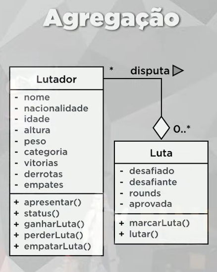</br>

> 'desafiado' 'desafiante' -> se colocar caractere vai ter que colocar o nome do lutador, em vez de utilizar um tipo primitivo, coloca um tipo abstrato, vou ter uma instância de lutador e essa instância de lutador vai o meu desafiado, cria uma relação entre o tipo abstrato e uma instâcia de uma determinada classe:

- Essa classe esta relacionando com outra classe; os atributos desafiado e desafiantes são instâncias de outra classe;
- A agregação é conhecida como relacionamento do tipo tem um, 'uma luta tem um lutador';

```
package com.ufc.pacote;

public class Luta {
	private Lutador desafiado;
	private Lutador desafiante;
	private int rounds;
	private boolean aprovada;
}
```

> 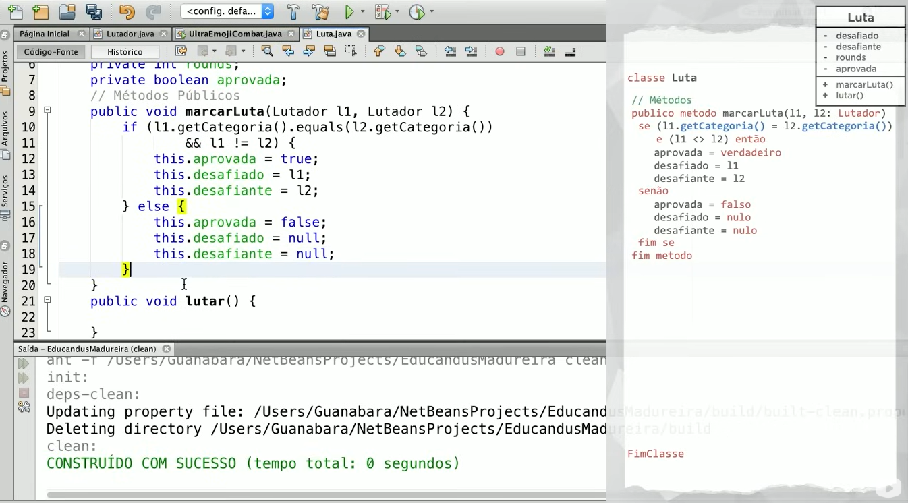</br>

> 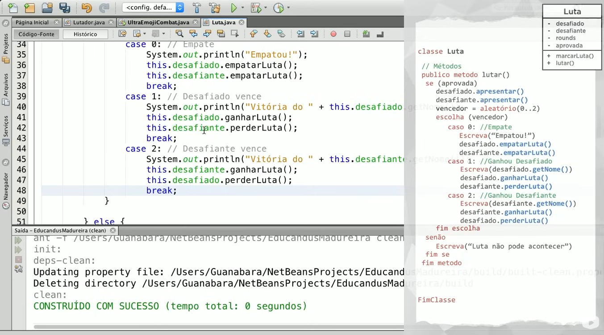</br>

```
LUTA

package com.ufc.pacote;

import java.util.Random;

public class Luta {
	private Lutador desafiado;
	private Lutador desafiante;
	private int rounds;
	private boolean aprovada;


	public Lutador getDesafiado() {
		return this.desafiado;
	}

	public void  setDesafiado(Lutador ado) {
		this.desafiado = ado;
	}

	public Lutador getDesafiante() {
		return this.desafiante;
	}

	public void setDesafiante(Lutador ante) {
		this.desafiante = ante;
	}

	public int getRounds() {
		return this.rounds;
	}

	public void setRounds(int r) {
		this.rounds = r;
	}

	public boolean getAprovada() {
		return this.aprovada;
	}

	public void setAprovada(boolean a) {
		this.aprovada = a;
	}

	public void marcarLuta(Lutador L1, Lutador L2){
		if (L1.getCategoria().equals(L2.getCategoria())
			&&  L1 != L2) {
				this.aprovada = true;
				this.desafiado = L1;
				this.desafiante = L2;
			} else {
				this.aprovada = false;
				this.desafiado = null;
				this.desafiante = null;
			}
	}

	public void lutar() {
		if (this.aprovada) {
			System.out.println("DESAFIADO");
			this.getDesafiado().apresentar();
			System.out.println("DESAFIANTE");
			this.getDesafiante().apresentar();

			Random aleatorio = new Random();
			int vencedor = aleatorio.nextInt(3); // vai gerar 3 resultados 0 1 2
			switch(vencedor) {
			case 0: //Empate
				System.out.println("EMPATOU");
				this.getDesafiado().empatarLuta();
				this.getDesafiante().empatarLuta();
				break;

			case 1:// Desafiado vence
				System.out.println("Vitória do " + this.getDesafiado().getNome());
				this.getDesafiado().ganharLuta();
				this.desafiante.perderLuta();
				break;
			case 2: // Desafiante vence
				System.out.println("Vitória do " + this.getDesafiante().getNome());
				this.getDesafiante().ganharLuta();
				this.getDesafiado().perderLuta();
				break;
			}


		} else {
			System.out.println("A luta não pode acontecer");
		}

	}
}
```

```
MAIN

package com.ufc.pacote;

public class Ufc {
	public static void main(String[] args) {
		Lutador[] L = new Lutador[6];
		L[0] = new Lutador("JAVA", "França", 31, 1.75f, 68.9f, 11, 3, 1);
		L[1] = new Lutador("JS", "Brasil", 31, 1.7f, 57.8f, 11, 3, 1);
		L[2] = new Lutador("CSS", "Argentina", 31, 1.75f, 80.9f, 11, 3, 1);
		L[3] = new Lutador("HTML", "Holanda", 31, 1.75f, 81.6f, 11, 3, 1);
		L[4] = new Lutador("REACT", "Espanha", 31, 1.75f, 62f, 11, 3, 1);
		L[5] = new Lutador("C#", "Alemanha", 31, 1.75f, 53f, 11, 3, 1);

		Luta UEC01 = new Luta();
		UEC01.marcarLuta(L[0], L[1]);
		UEC01.lutar();

		L[0].status();
		L[1].status();

	}
}
```

> EXERCICIO

> 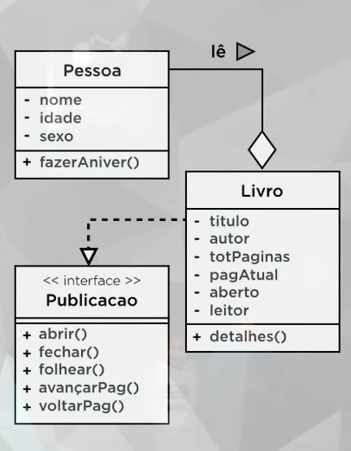</br>

> 'to.string' -> ele retorna uma String
> 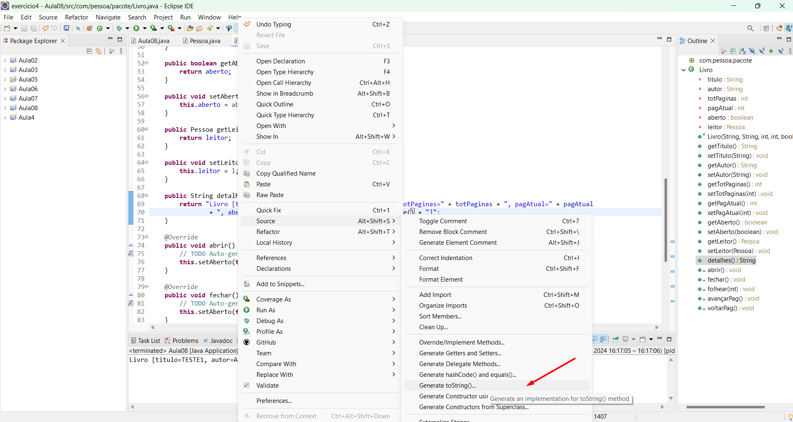</br>

```
LIVRO
	public String detalhes() {
		return "Livro [titulo=" + titulo + ", autor=" + autor + ", totPaginas=" + totPaginas + ", pagAtual=" + pagAtual
				+ ", aberto=" + aberto + ", leitor=" + leitor.getNome() + "]";
	}
```

```
AULA 08 - MAIN
System.out.println(l[0].detalhes());
```

> HERANÇA -> os filhos herdam características e comportamentos de uma mãe;</br> > 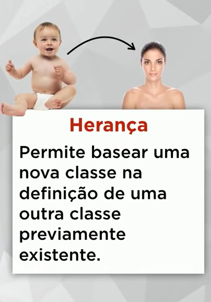</br> > </br> > 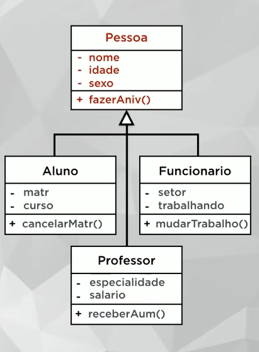</br>

- 'extends' -> é ampliar, nesse exemplo estou ampliando as características de pessoas;
  > 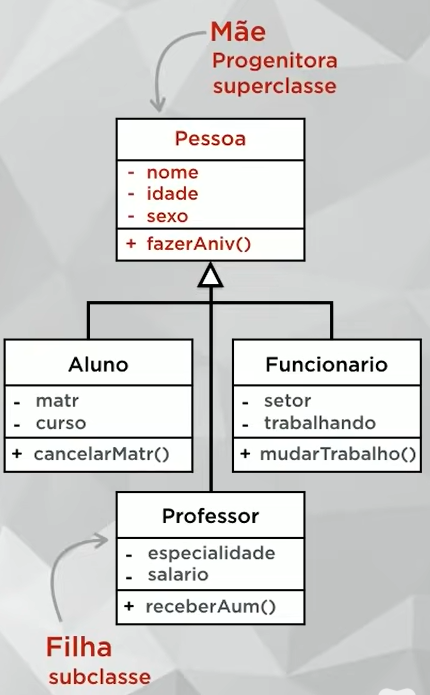</br>

```
package com.aula09.pacote;

public class Aluno extends Pessoa {
	private int matr;
	private String curso;
}
```

> 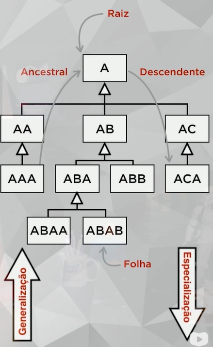</br>

> TIPOS DE HERANÇA

> 1 - Herança de implementação -> também é conhecida como herança pobre, a mais simples que existe;

> 2 - Herança para diferença -> é a herança mais completa;

> 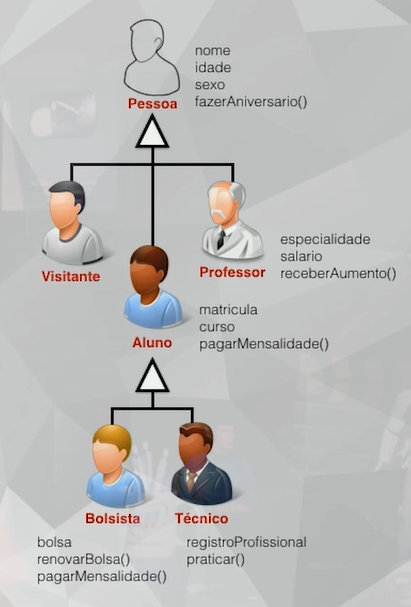</br>

> CONCEITO ABSTRATO E FINAL -> vai depender de onde aplicar esse conceito, um método e uma classe podem ser abstratos e finais, então pode ter um método abstrato e final e também pode ter uma classe abstrata e uma classe final, o nome é o mesmo o final e abstrato mas a funcionalidade a operabilidade disso vai ser diferente;

- CLASSE ABSTRATA -> defini uma classe como abstrata, ela não pode gerar filhos 'objetos';
- MÉTODO ABSTRATO -> só pode ser colocado dentro de uma interface ou de uma classe abstrata;
- CLASSE FINAL -> ela não pode ter filhos, é obrigatoriamnete uma folha, ela não pode utilizar herança;
- MÉTODO FINAL -> ele não pode ser sobreposto isso é não pode gerar uma especialização desse método;
  > 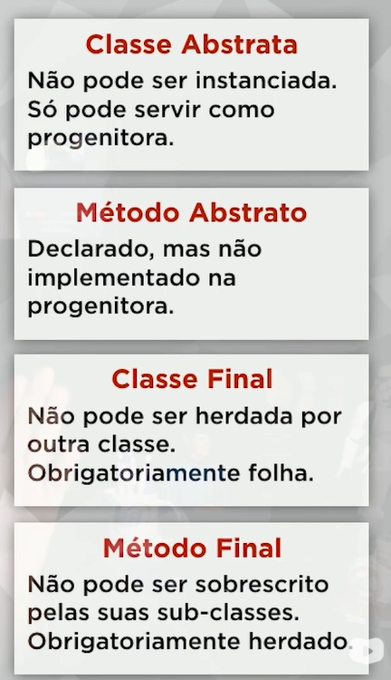</br>

> 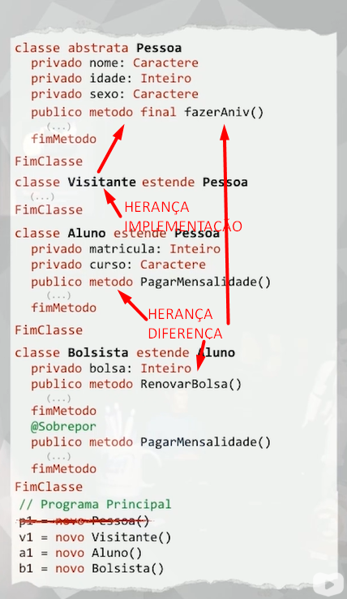</br>

**(...) continua ->Curso POO Java #11b - Herança (Parte 2)**

## �� Tecnologias

<div>
  
  
 
          
</div>
