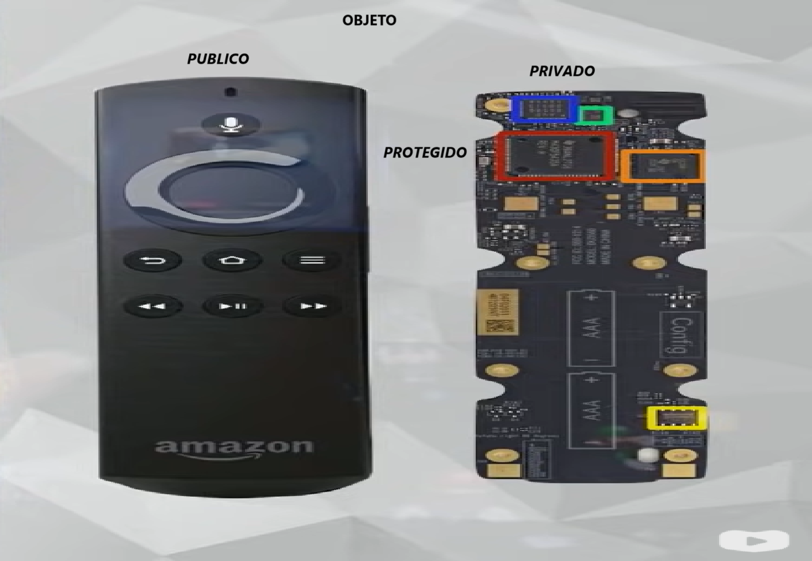

<h1 align="center">JAVA Programação Orientada a Objetos</h1>

<h3 align="center"> Canal do YouTube: <a href="https://www.youtube.com/watch?v=KlIL63MeyMY&list=PLHz_AreHm4dkqe2aR0tQK74m8SFe-aGsY">Gustavo Guanabara
</a> </h3>

> _Eu fiz com Eclipse_

**(...) continua ->Curso POO Java #03b - Configurando Visibilidade de Atributos e Métodos**

> POO -> aproximar o mundo digital do mundo real
> 

> Vantagens
> 

> Objeto -> pode ser concretos (físicos - carro, celular) ou conceituais (abstrações - um horário marcado, uma aula)

- características - atributo, propriedade, dados;
- comportamentos - métodos, procedimentos das rotinas internas desse objeto;
- estado ou status - características atuais no momento em que esta analisando esse objeto;
- Todo objeto vem a partir de uma classe, um molde que foi utilizado para criar essa classe, esse objeto precisa ser planejado;

  > 

- Consegui dentro dos métodos mexer com os atributos do objeto e interagir dessa maneira com usuário:
  > 
  > 
  >  

> Classe e Objeto -> um conceito depende do outro

- Quando tem uma classe e quero transformar em objeto é instanciamento;
- Instanciar é quando pega uma classe e consegui gerar um objeto a partir dela, não transforma uma classe em objeto, gera um objeto a partir de uma classe chama isso de instanciar;
- Uma classe define os atributos e métodos comuns que serão compartilhados por um objeto;
- O objeto é uma instância de uma classe, quando instâcia uma classe cria um objeto;
  > 
  >  

> Conceito de abstração

- Quais são os atributos que me importam nesse momento ? EX.: pessoas tem várias caracteristicas, em um cadastro escolar não precisa ter peso, altura, cor dos olhos...

> 'this' -> é o nome do objeto que chamo, no exercicio quem chamo tampar foi 'c1', então o 'this' é substituido por 'c1' no momento em que 'c1' chamar o método tampar;

- Sempre que quiser modificar algum atributo dentro da própria classe coloque a palavra 'this' na frente da linha que vai mexer nesse atributo:

> 
>  

> Conceito LMU ou UML - lINGUAGEM DE MODELAGEM UNIFICADA

- Diagrama de classes -> em diagrama de classes toda classe é um retângulo(não precisa desenhar uma classe/molde - simplifica);
- Dentro desse retângulo na parte superior geralmente em negrito e a primeira letra em maiúsculo, coloca o nome da classe, depois faz 2 traços separando a parte de cima o cabeçalho, o miolo o corpo central e a parte de baixo;

> Classe - primeira letra maiúscula  
> Atributo - tudo minúscula e sem () 
> Método - tudo minúscula e com ()  >  

> Modificadores de Visibilidade

- Indicam o nível de acesso aos componentes internos de uma classe (atributos e métodos);
  > '+' público -> a classe atual e todas as outras classes;  
  > '-' privado -> somente a classe atual;  
  > '#' protegido -> a classe atual e todas as suas sub-classes; 'só minha mãe e os filhos dela';     
- A parte de fora pode ter acesso publico, interface;
- Os componentes é privado para não danificar; 
  **Cria-se essa cápsula para proteger e deixar disponível somente a parte publica**
- O componente que faz a transmissão infravermelho na televisão para fazer a interface, o uso desse componente tem que ficar inacessível ao dono mas também tem que deixar ele acessível a televisão, seria uma espécie de atributo protegido;
  > 

**(...) continua ->Curso POO Java #03b - Configurando Visibilidade de Atributos e Métodos**

## �� Tecnologias

  
  
 
          

